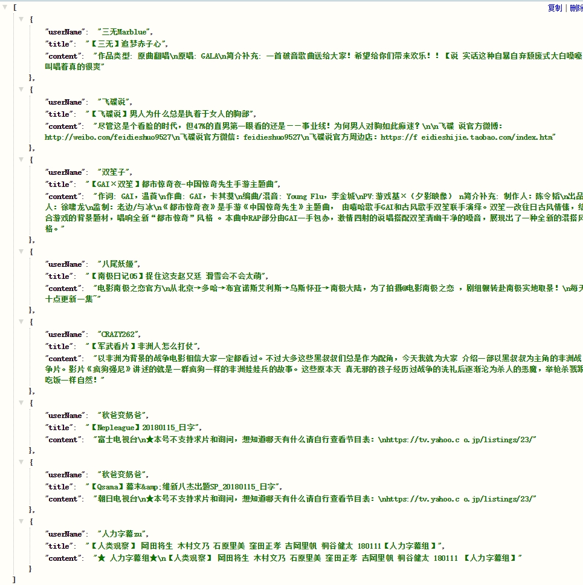

# bilibili-feed-puppeteer

## install

使用微博第三方登陆哔哩哔哩，通过puppetter抓取bilibili的动态更新

```bash
// node 7.6.0+ && windows环境
git clone
cd bilibili-feed-puppeteer
set PUPPETEER_SKIP_CHROMIUM_DOWNLOAD=1
npm install / yarn
// config.js 中填入微博 账号和密码
// 运行
node index.js
```

手动下载 [Chromium](https://download-chromium.appspot.com/),在根目录创建 chromium 文件夹，将下载的rar文件解压至chromium文件夹内

http://www.zhimengzhe.com/Javascriptjiaocheng/397024.html

## 测试效果



## TODO

* ~~增加Koa作为后台服务，暴露接口用于调用~~ (妈个鸡，这破站如果用headless模式还抓不出数据)
* 这东西当个玩具先留着吧,linux服务器上也不方便跑，蛋疼 (´；ω；｀)
